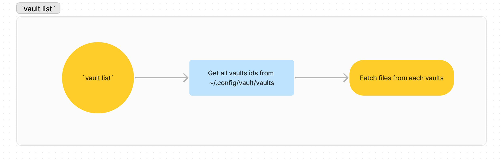

# Vault

## Motivation

> Imagine a client has a large set of potentially small files {F0, F1, …, Fn}
> and wants to upload them to a server and then delete its local copies. The
> client wants, however, to later download an arbitrary file from the server and
> be convinced that the file is correct and is not corrupted in any way (in
> transport, tampered with by the server, etc.).

## Design

The workflow is similar to `git`.

You can stage files with `vault add`, `vault status` will display the staged
files to be commited (remove them with `vault remove`).

When you are happy with the selection use `vault commit` to upload the files to
the server. The files will be deleted from your system. The
[merkle tree](https://www.wikiwand.com/en/Merkle_tree)'s root hash of the
vaulted files is saved in your local config files (typically
`~/.config/vault/vaults`) to ensure the integrity of your files.

You can then use the `vault list` to list all your vaulted files, and the
`vault download` command can be used to download them again. When a file is
downloaded from the remote server, an integrity check is performed:

- the file and its Merkle Proof are downloaded
- the Merkle tree root's hash is retrieved from the proof
- and is checked against the local hash computed locally during the
  corresponding `commit`

This ensures that the file has not been corrupted by the server, nor the
transportation.

### CLI

#### `vault add`

#### `vault status`

#### `vault commit`

#### `vault list`

#### `vault download`

## Features ideas

- [ ] Bulk file upload/download
- [ ] Authentication
- [ ] Named Vault
- [ ] Option to encrypt files before vaulting them
- [ ] "Writable" Vault (keep all files hash? download the whole vault > add file
      > commit it?)
